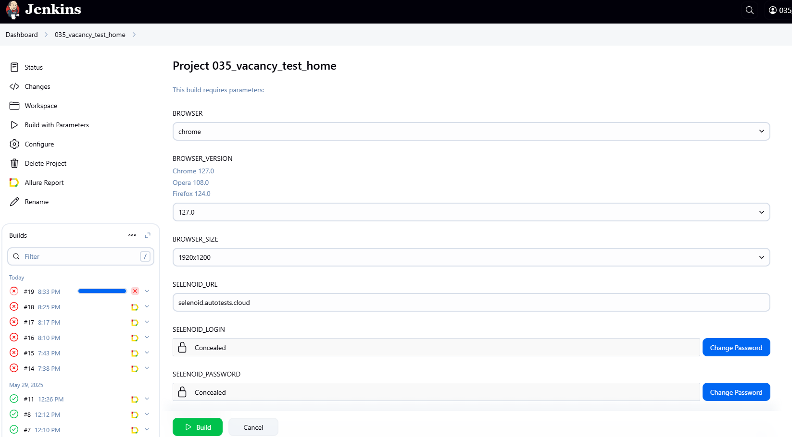
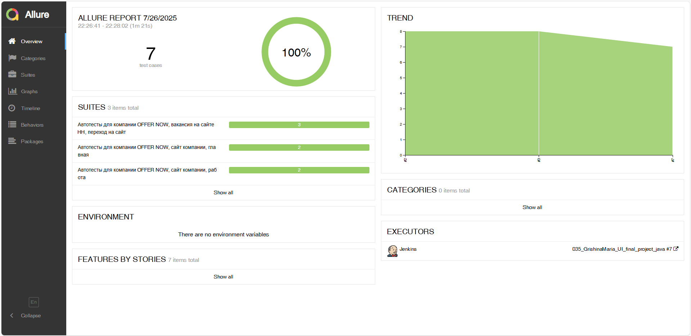
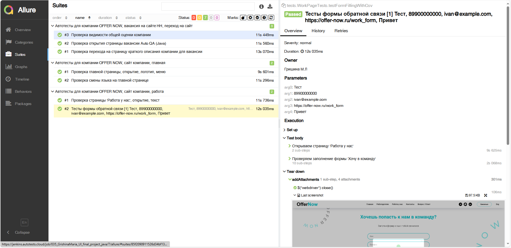
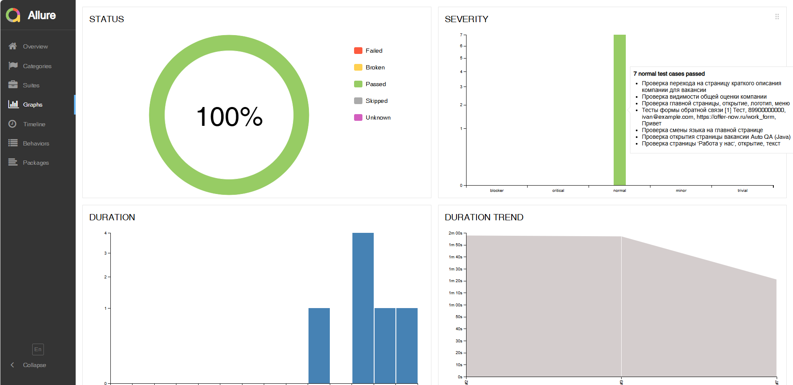
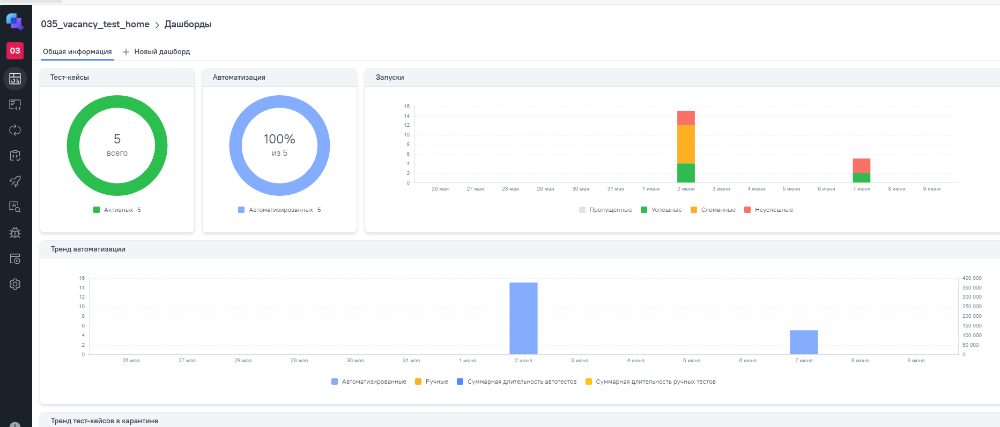
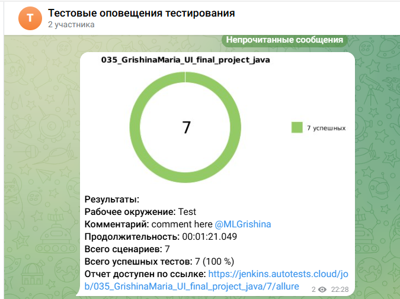

<p align="center">
  <a href="https://offer-now.ru/" target="_blank" title="Официальный сайт компании" style="text-decoration: none;">
    
    <br>
    <span style="color: #0066cc; font-size: 1.25rem; font-weight: 600; margin-top: 8px; display: inline-block;">
         </span>
  </a>
</p>

<div align="center">
  <h2> ПРОЕКТ АВТОМАТИЗАЦИИ |  OFFER NOW</h2>
</div>

---
<table>
  <tr>
    <td style="background-color: #f5f9ff; padding: 20px; border: 1px solid #e0e8f5;">

## :scroll: Содержание:

- [Используемый стек](#используемый-стек)
- [Запуск автотестов](#запуск-автотестов)
- [Сборка в Jenkins](#сборка-в-jenkins)
- [Пример Allure-отчета](#пример-allure-отчета)
- [Интеграция](#Интеграция)
- [Уведомления в Telegram](#уведомления-в-telegram)
- [Видео примера запуска тестов](#видео-примера-запуска-тестов)

---

<a id="используемый-стек"></a>

# :computer: Используемый стек

<br>

<p align="center">
  <a href="https://www.jetbrains.com/idea/" target="_blank"></a>
  <a href="https://www.java.com/" target="_blank"></a>
  <a href="https://selenide.org/" target="_blank"></a>
  <a href="https://aerokube.com/selenoid/" target="_blank"></a>
  <a href="https://docs.qameta.io/allure/" target="_blank"></a>
  <a href="https://gradle.org/" target="_blank"></a>
  <a href="https://junit.org/junit5/" target="_blank"></a>
  <a href="https://github.com/" target="_blank"></a>
  <a href="https://www.jenkins.io/" target="_blank"></a>
  <a href="https://docs.qameta.io/allure-testops/" target="_blank"></a>
  <a href="https://telegram.org/" target="_blank"></a>
</p>

<br>

Тесты в данном проекте написаны на языке <code>Java</code> с использованием фреймворка для тестирования <code>
Selenide</code>, сборщик - <code>Gradle</code>. <code>JUnit 5</code> задействован в качестве фреймворка модульного
тестирования.

При прогоне тестов для запуска браузеров используется <code>Selenoid</code>.
Для удаленного запуска реализована джоба в <code>Jenkins</code> с формированием Allure-отчета и отправкой результатов
в <code>Telegram</code> при помощи бота. Так же реализована интеграция с <code>Allure TestOps</code> и <code>
Jira</code>.

<br>

### ✅ Проверки

- ✔️ **Проверка открытия страницы вакансии Auto QA (Java)**
- ✔️ **Проверка перехода на страницу краткого описания компании из вакансии**
- ✔️ **Проверка видимости общей оценки компании**
 
<br>

- ✔️ **Проверка главной страницы, открытие, логотип, меню**
- ✔️ **Проверка смены языка на главной странице**

<br>

- ✔️ **Проверка страницы 'Работа у нас', открытие, текст**
- ✔️ **Тесты формы обратной связи**

<br>


<a id="запуск-автотестов"></a>

### ✨ | 🖥️ Запуск автотестов из терминала | ✨

```
gradle clean test
-Dbrowser=chrome 
-DbrowserVersion=127.0 
-DbrowserSize=1920x1200 
-DselenoidUrl=selenoid.autotests.cloud 
```

При выполнении данной команды в терминале IDE тесты запустятся удаленно в <code>Selenoid</code>.

<br>

---

<a id="сборка-в-jenkins"></a>
<p align="center"> 

# <a href="https://jenkins.autotests.cloud/job/035_vacancy_test_home/" target="_blank"> Сборка в Jenkins

</p>

_Jenkins — инструмент для автоматизации:_

- _✔️ Сборка и тестирование кода при каждом изменении (CI);_

- _✔️ Развертывание (CD) в тестовые/prod-среды;_

- _✔️ Контроль качества (проверка компиляции, тесты, анализ);_

- _✔️ Экономия времени за счёт замены ручных процессов;_

_Работает с любыми языками, гибко настраивается через плагины и скрипты.
Подходит для командной разработки, чтобы быстро находить ошибки и ускорять выпуск версий._


Для запуска сборки необходимо перейти в раздел <code> Build with Parameters:</code> и нажать кнопку <code>Build</code>.
<p align="center">


</p>

После выполнения сборки, в блоке <code>История сборок</code> напротив номера сборки появятся значки <code>Allure
Report</code>, при клике на которую откроется страница с сформированным отчетом.

<br>

---

<a id="пример-allure-отчета"></a>
<p align="center">


#  Пример Allure-отчета
_Allure Report_ — это визуализированный отчёт о тестировании, который делает результаты запусков автотестов удобными для анализа.

### _Преимущества:_
- _Наглядность_
    - Дерево тестов, графики, скриншоты, шаги выполнения.
- _Детализация_
    - Логи, ошибки, параметры тестов (например, данные из CSV).
- _Интеграция_
    - Работает с JUnit, TestNG, pytest, Selenium и CI-инструментами (Jenkins, TeamCity).
- _История запусков_
    - Сравнение результатов по времени (тренды, регрессы).

<br>

### ✨ | 📑 Содержание Allure-отчета | ✨

* Шаги теста;
* Скриншот страницы на последнем шаге;
* Page Source;
* Логи браузерной консоли;
* Видео выполнения автотеста.

<br>

### 🔍 Обзор

<p align="center">
  <a href="https://jenkins.autotests.cloud/job/035_vacancy_test_home/29/allure/" target="_blank" rel="noopener noreferrer">
    
  </a>
</p>

### 📂 Группы тестов
<p align="center">
  <a href="https://jenkins.autotests.cloud/job/035_vacancy_test_home/29/allure/#suites/a657a03f5cf0e7f2aa2f3b2cec09b6fd/b0c9276acbc5217e/" target="_blank" rel="noopener noreferrer">
    
  </a>
</p>

### 📈 Анализ тестов

<p align="center">
  <a href="https://jenkins.autotests.cloud/job/035_vacancy_test_home/29/allure/#graph" target="_blank" rel="noopener noreferrer">
    
  </a>
</p>

<br>

---

<a id="Интеграция"></a>

# <a href="https://allure.autotests.cloud/project/4774/dashboards" target="_blank"> Интеграция с Allure TestOps</a>
_Allure TestOps_ — это платформа для управления тестированием на базе Allure Report с расширенными возможностями.

### _Основные функции:_
- _Централизованное_ хранение и анализ результатов тестов
- _Интеллектуальная_ аналитика и дашборды
- _Интеграция_ с популярными CI/CD и тест-фреймворками


<p align="center">
   <br>

</p>

<br>

---

<a id="уведомления-в-telegram"></a>

#  Результат выполнения автотестов в Телеграм

После завершения сборки специальный бот, созданный в <code>Telegram</code>, автоматически обрабатывает и отправляет
сообщение с отчетом о прогоне тестов.

<p align="center">

</p>

<br>

---

<a id="видео-примера-запуска-тестов"></a>

#  Видео примера запуска тестов в Selenoid

В отчетах Allure для каждого теста прикреплен не только скриншот, но и видео прохождения теста

<br>

<p align="center">
  
</p>

   </td>
  </tr>
</table>